# ESPHome-for-Watchy

Watchy is an open-hardware, ESP32 wrist watch with e-paper display designed by SQFMI.

https://watchy.sqfmi.com/

This project is a minimal ESPHome configuration file for the Watchy hardware.

https://esphome.io/

It is a complete, self-contained, drop-in replacement for the original firmware.

## The Watch

<a href="./doc/buttons.jpeg">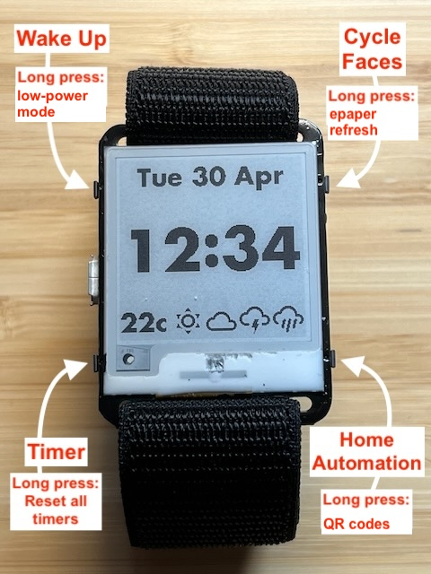</a>
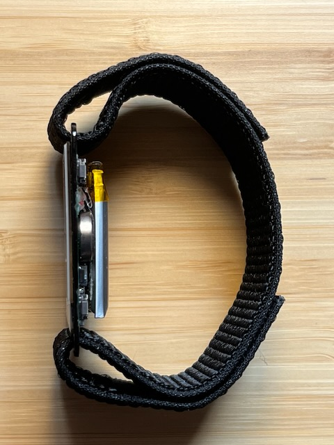

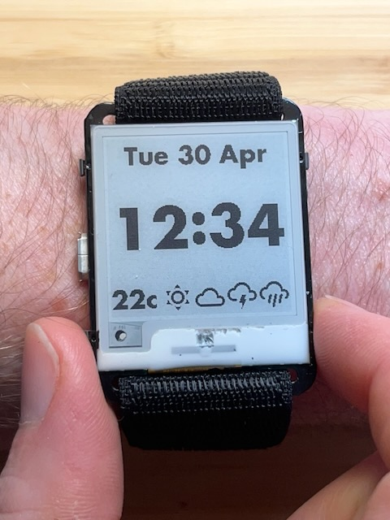

## Faces

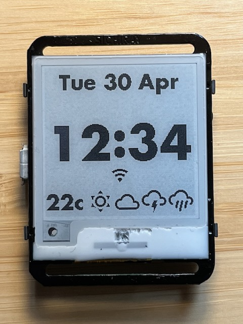

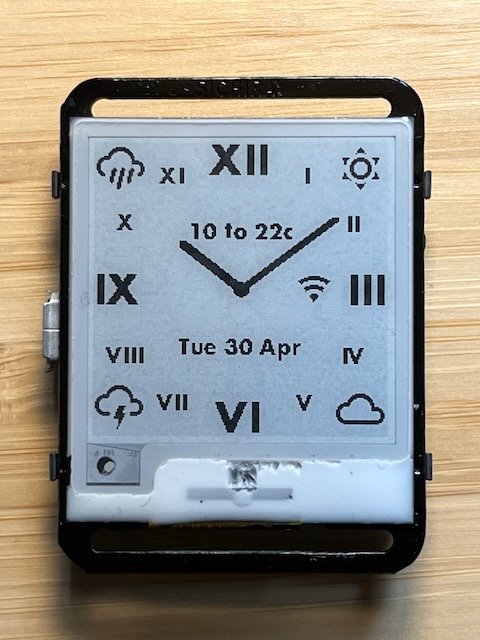
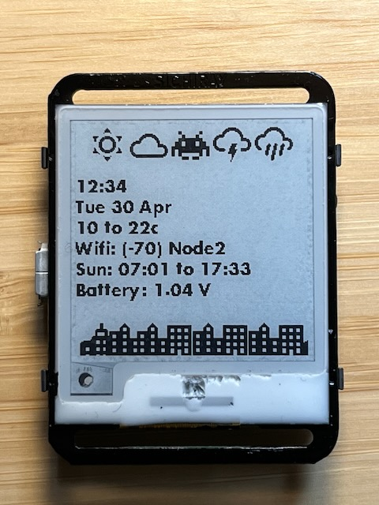
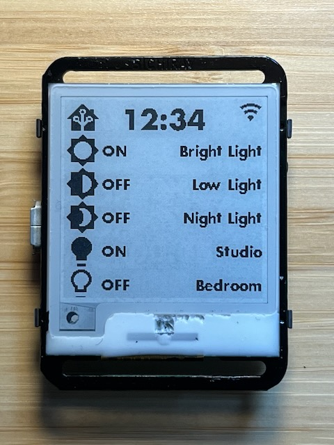
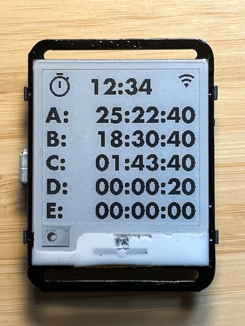

## Design Philosophy

### Low Power Usage

A low-distraction, low-interaction, passive device.

This is primarily a watch, for showing the time, with a few extra "read-only", "at-a-glance" watch-like complications such as a weather forecast.

Wifi is utilised primarily for read-only connectivity features such as updating accurate internet time, DST adjustments and a weather forecast. It is a truly "automatic" watch!

Wifi, which uses a lot of power, will only activate automatically 4 times a day.

In the future, I hope to sync with a calendar once a day.

### Interactivity

Interactive features such as the stop-watch and Home Assistant (or MQTT) controls should be used sparingly because the battery is small and the display is slow.

Multiple buttons and long-press buttons remain free for your own extensions.

### Settings

Intentionally, this project does not include any on-watch settings screens or user-configuration. The idea is that the ESPHome YAML file is simple and easy enough for it to be edited directly, and re-flashed to the ESP32 device. The YAML _is_ the settings UI.

# Manual

## Buttons

## Weather

The watch shows a weather forecast over the upcoming 12 hours. This is a simple, practical, human-ergonomics amount of time for planning ahead using a wrist watch.

<a href="./doc/weather01.jpeg">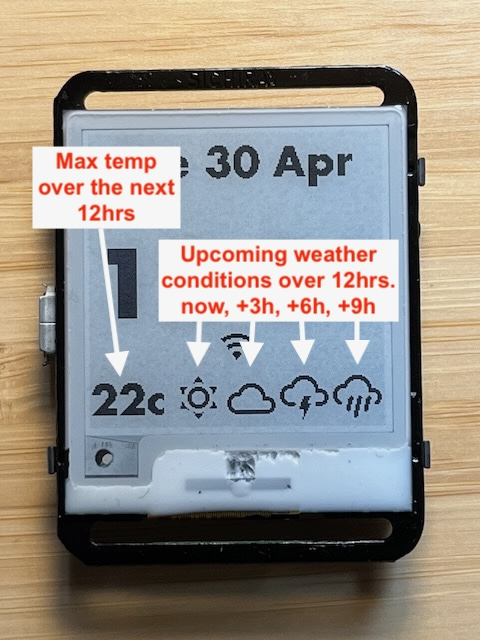</a>
<a href="./doc/weather02.jpeg">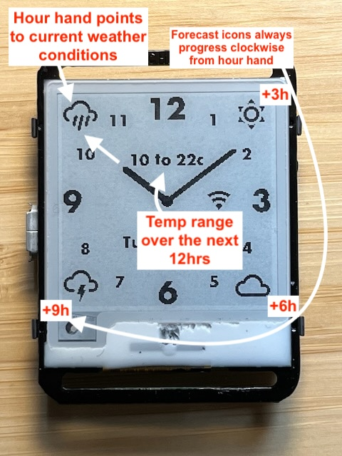</a>

## Timer Operation

Press the left-bottom button to show the timers page:

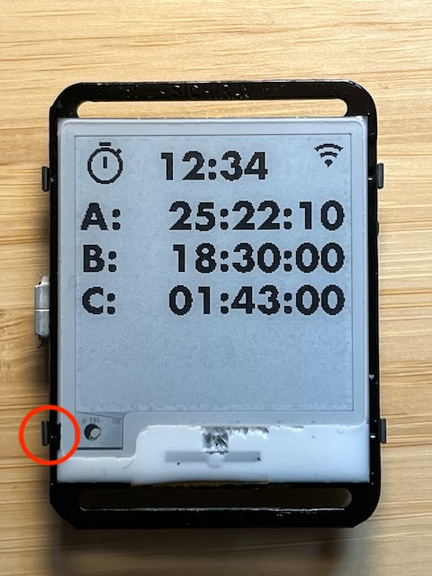

Press the left-bottom button again to start a new timer, added to the bottom (D):

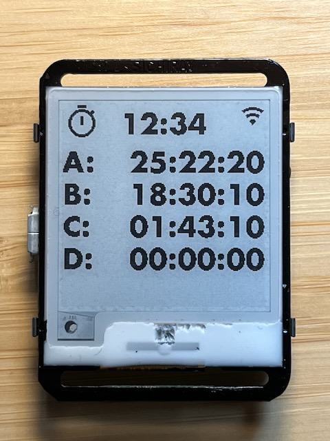

Press again for another timer (E):

Press-and-hold (2s) the left-bottom button to clear all timers and start over:

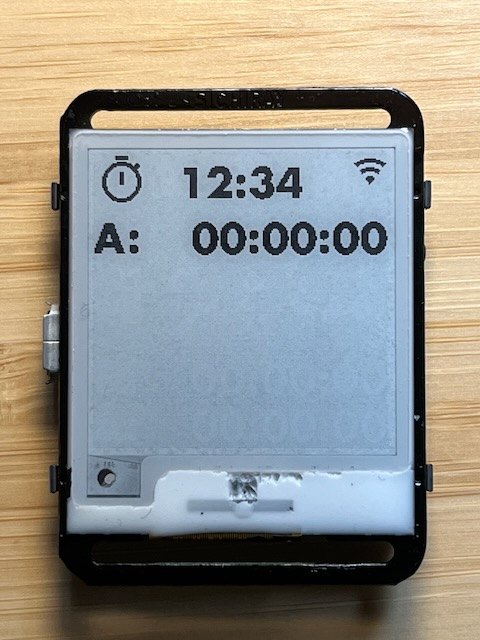

When the page is full, a button press will discard the oldest timer and start a new one at the bottom. All the other timers move up one slot, maintaining their letter-codes. In this example, A, which has been restarted, moves to the bottom. Then, on another press, B.

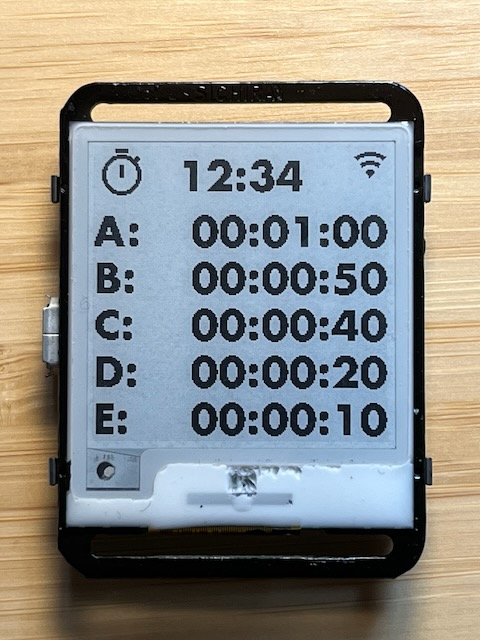
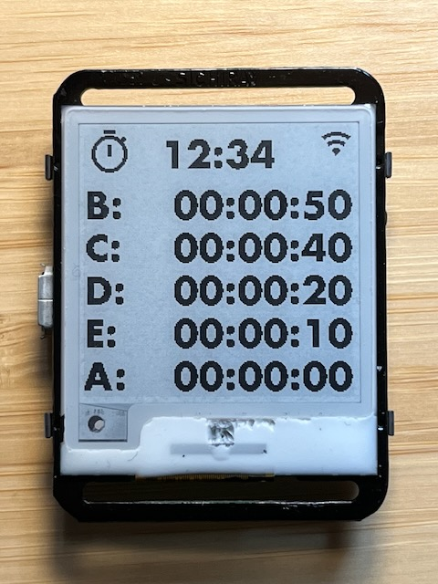
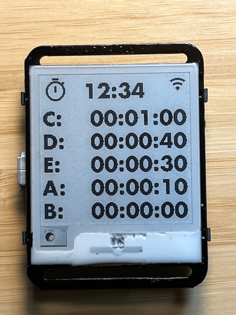
