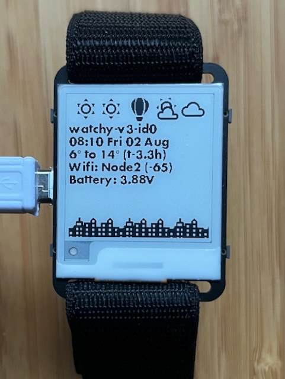
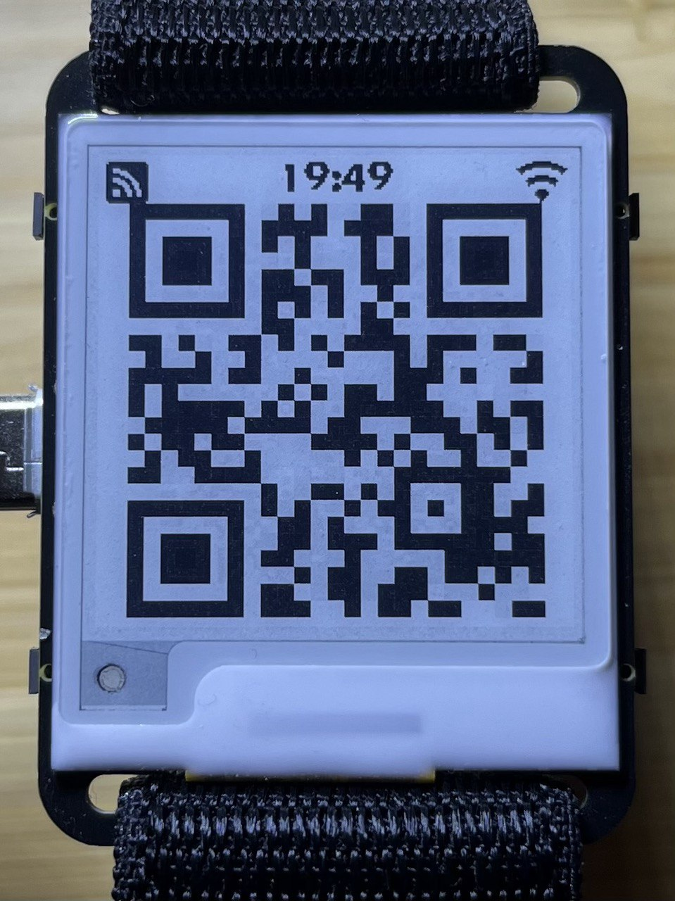

# ESPHome-for-Watchy

Single-file source code here: [./watchy.yaml](./watchy.yaml)

[Watchy](https://watchy.sqfmi.com/) is an [open-hardware](https://watchy.sqfmi.com/docs/hardware), ESP32 wrist watch with e-paper display designed by SQFMI.

This project is a complete working firmware, built upon [ESPHome](https://esphome.io/), with [single-file source-code](./watchy.yaml), full v3 hardware support, weather forecast, multiple faces, [beautiful pixel-art MDI icons](https://pictogrammers.com/library/mdi/), stop-watch timers, low-power-mode, firmware updatable over wifi and easy Home Assistant customisation. It is a complete, self-contained, drop-in replacement for the original Watchy firmware.

## Faces

Included faces (cycle through them using the top-right button):

<!--  -->
<!--  -->

## Install / Flash

1. [Install ESPHome compiler](https://esphome.io/guides/getting_started_command_line) and optional [VSCode extension](https://marketplace.visualstudio.com/items?itemName=ESPHome.esphome-vscode)
1. Sign up at https://openweathermap.org/ to get an API key
1. `cp config-example.yaml config.yaml`
1. Edit your `config.yaml` file
1. Connect your Watchy to USB and run `esphome run watchy.yaml`
1. Thats it!

## About ESPHome

[ESPHome](https://esphome.io/): "is a system to control your microcontrollers by simple yet powerful configuration files and control them remotely through Home Automation systems."

As this project is based on ESPHome, there is excellent, existing documentation and community support for all the submodules and their many customisation options. For example: [wifi with multiple networks](https://esphome.io/components/wifi.html#connecting-to-multiple-networks), [display graphics and rendering](https://esphome.io/components/display/), [ePaper drivers](https://esphome.io/components/display/waveshare_epaper.html), [GPIO](https://esphome.io/components/binary_sensor/gpio), [button actions](https://esphome.io/components/binary_sensor/), [NTP time-sync](https://esphome.io/components/time/sntp.html), [time events](https://esphome.io/components/time/#on-time-trigger) and [HTTP API calls](https://esphome.io/components/http_request.html), [ESP32 deep-sleep](https://esphome.io/components/deep_sleep.html), [wireless firmware updates (OTA)](https://esphome.io/components/ota/), [captive portal](https://esphome.io/components/captive_portal.html), [battery voltage ADC](https://esphome.io/components/sensor/adc.html) and many more.

## The Watch

### Watchy hardware v3 - NEW 2024!

- Watchy v3: [./watchy.yaml](./watchy.yaml)

Update: New (2024) v3 module arrived via [Mouser Electronics](https://au.mouser.com/ProductDetail/SQFMI/SQFMI-WATCHY-10?qs=DRkmTr78QARN9VSJRzqRxw%3D%3D). It has hardware changes including ESP32-S3, RTC and [rearranged pins](https://github.com/sqfmi/Watchy/compare/667d86737dd3dcedf67d83cf69553b28f4e1f38b..master).

IDEADS:

- Clicker-counter mode
- Auto-sleep could be delayed longer if wifi is already disabled
- Preset count-down timers
- Enable/disable hourly alarms on the watch

### Watchy hardware v2

A backwards compatible version is also available for older v2 hardware: [./v2-watchy.yaml](./v2-watchy.yaml)

## Design Approach

### Low Power Usage

A low-distraction, low-interaction, unobtrusive and wearable device.

This is primarily a watch, for showing the time, with a few extra "read-only", "at-a-glance" watch-like complications such as a weather forecast.

Wifi is utilised primarily for read-only connectivity features such as updating accurate internet time, DST adjustments and a weather forecast. It is a truly "automatic" watch!

Wifi, which uses a lot of power, will only activate automatically 4 times a day.

In the future, I hope to sync with a calendar once a day.

### Minimal Interactivity

Interactive features such as the stop-watch and Home Assistant (or MQTT) controls should be used sparingly because the battery is small and the display is slow.

Multiple buttons and long-press buttons remain free for your own extensions.

### No Onboard User Settings UI

Intentionally, this project does not include any on-watch user settings screens or user configuration. The idea is that the ESPHome YAML file is simple and easy enough for it to be edited directly, and re-flashed to the ESP32 device. **The YAML _is_ the settings UI and the main feature of an open-source, programmable, WiFi watch is that it is easily reprogrammable over WiFi.**

## User Manual

### Buttons

#### Top Left

- Press: Power On
- 2nd Press: Wifi On
- Long Press (2s): Set power-saving mode and go to sleep

#### Top Right

- Press: Cycle watch faces (digital, hands, roman, info, etc)
- Long Press (2s): ePaper full-refresh (this clears away ghost pixels)

#### Bottom Left

- Press: Start new timer (and show timers page) (up to 5 timers)
- Long Press (2s): Cancel last active timer
- Long Press (3s): Clear all tiemrs

#### Bottom Right

- Press: Show Home Assistant page (intentionally left unused for custom features)
- Long Press (2s): Show QR Codes
  - Press (in QR mode): Cycle QR codes

### Weather

The watch shows a weather forecast over the upcoming 12 hours. This is a simple, practical, human-ergonomics amount of time for planning ahead using a wrist watch.

### Timers Operation

Press the left-bottom button to show the timers page:

Press the left-bottom button again to start a new timer, added to the bottom (D):

Press again for another timer (E):

Press-and-hold (2s) the left-bottom button to clear all timers and start over:

When the page is full, a button press will discard the oldest timer and start a new one at the bottom. All the other timers move up one slot, maintaining their letter-codes. In this example, A, which has been restarted, moves to the bottom. Then, on another press, B.

### Home Assistant

Create your own customisations for Home Assistant integration. See [documentation](https://esphome.io/components/api.html)

### Weather Faces

These are useful for wall-mounting older/spare Watchy modules:

### QR-Code Contact Card / ID Badge

You know... just in case you accidentally find yourself at a meet-up or conference without a phone, tablet or business card and can't remember your own email or website addresses, don't panic, you have your watch!

([vCard](https://nfraprado.net/post/vcard-rss-as-an-alternative-to-social-media.html) is neat because your information can be scanned directly in to the recipients ~~rolodex~~ contacts app when wifi or internet is unavailable.)

vCard, Website and RSS URL can be set in `secrets.yaml`.

## Installation Notes

### Fonts

Download and save `Futura Bold.otf` from:

https://freefonts.co/fonts/futura-bold

Download and save `materialdesignicons-webfont.ttf` from:

https://github.com/Templarian/MaterialDesign-Webfont/tree/master/fonts

Save the files to `fonts` directory.

### Material Design Icons

1. Find new icons over at [Pictogrammers Material Design Icons](https://pictogrammers.com/library/mdi/)
1. Click on the icon and copy the name like this `mdiAbacus` from the code like this `import { mdiAbacus } from '@mdi/js';`
1. Paste the new icon name under the `fonts:` section of `watchy.yaml` with a leading `$`, eg `$mdiAbacus`
1. Then run `node generate-mdi.js` to make the icon available in CPP and YAML files
1. Or, alternatively, manually add the new icon to `mdi.yaml` and `mdi.h`

### Install ESPHome compiler tool on Mac OSX

https://esphome.io/guides/installing_esphome.html#mac

    brew install esphome
    brew install pillow
    brew unlink pillow

Download:
https://raw.githubusercontent.com/Homebrew/homebrew-core/fc831c5d76dc2eb6dbe2265ca9b6ca93d27140bc/Formula/p/pillow.rb

    brew install ./pillow.rb
    brew pin pillow

### Enter Watchy Bootloader Mode (v3 only)

https://watchy.sqfmi.com/docs/getting-started#uploading-new-watchfacesfirmware

To upload new firmware/watchfaces to Watchy, you will need to enter **bootloader** mode

1. Plug in the USB on Watchy
1. Press and hold the top 2 buttons for more than 4 seconds, then release the **Left button first**, before releasing the Up button
1. You should now see an ESP32S3 device enumerate a serial port i.e. COM, cu.\*

### Install Flash with a unique ID

1. `cp config-example.yaml config.yaml`
1. Edit your secrets.yaml
   1 `esphome -s ID 1 run watchy.yaml`

### Reset Watchy (v3 only)

1. Press and hold the top 2 buttons for more than 4 seconds, then release the **Right button first**, before releasing the Back button
1. Watchy should now reset, wait a few seconds for it to boot up and refresh the screen

## Watchy Hardware Mods

_Disclaimer: This following is not advice._

I have had the USB socket break off a previous watch so I added epoxy glue around edges of socket and battery clip to secure them.

Then I painted the back electronic components with silicone to keep dry and clean.

I discarded the huge, clumsy watch case that comes in the box! Threading a Garmin Fenix band through the Watchy PCB slots, I attached the battery to the band under the wrist area. This resulted in a hidden battery and thin watch profile.

## Patched ESPHome ePaper Component

See https://esphome.io/components/external_components.html

This project used a slightly modified module forked from the main ESPHome project.

The minor customisations for Watchy are:

- Prevent a full ePaper refresh on ESP32 boot which is not the desired behaviour for a low-power watch.
  https://github.com/multipolygon/esphome/commit/6407a74ff9855d515cb16fef67f90c748f9800ea
- Add a pubic `do_full_update()` method to trigger the full-refresh only at certain times of day - a full update clears away ghost pixels.
  https://github.com/multipolygon/esphome/commit/ecf116058cc4b20007126f9099f4b07f4d46b9dd

## Captive Portal

https://esphome.io/components/captive_portal.html

Captive Portal could be enabled to generate a reusable firmware binary and set wifi name and password by connecting directly to the device.
