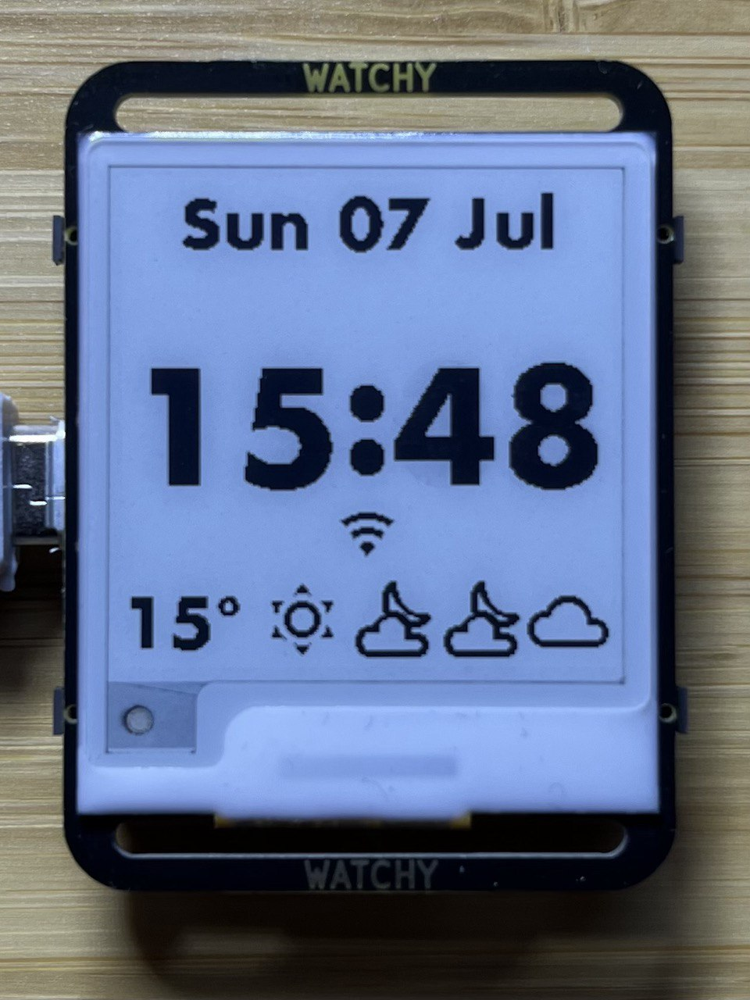

# ESPHome-for-Watchy

ESPHome YAML: [./watchy.yaml](./watchy.yaml)

Watchy is an open-hardware, ESP32 wrist watch with e-paper display designed by SQFMI.

https://watchy.sqfmi.com/

https://watchy.sqfmi.com/docs/hardware

This project is a functional ESPHome configuration file for the Watchy hardware.

https://esphome.io/

It is a complete, self-contained, drop-in replacement for the original firmware.

## The Watch

### Watchy hardware v3 - NEW 2024!

- Watchy v3: [./watchy.yaml](./watchy.yaml)

Update: New (2024) v3 module arrived via [Mouser Electronics](https://au.mouser.com/ProductDetail/SQFMI/SQFMI-WATCHY-10?qs=DRkmTr78QARN9VSJRzqRxw%3D%3D). It has hardware changes including ESP32-S3, RTC and rearranged pins.

TODO:

- ESP32-S3 on-board RTC - It works, but how!?
- Battery voltage ADC - Untested
- Step counter (BMA)

https://github.com/sqfmi/Watchy/compare/667d86737dd3dcedf67d83cf69553b28f4e1f38b..master

### Watchy hardware v2

- Watchy v2: [./watchy_v2.yaml](./watchy_v2.yaml)

Sichiray via AliExpress

## Multiple Faces

## Design Approach

### Low Power Usage

A low-distraction, low-interaction, unobtrusive and wearable device.

This is primarily a watch, for showing the time, with a few extra "read-only", "at-a-glance" watch-like complications such as a weather forecast.

Wifi is utilised primarily for read-only connectivity features such as updating accurate internet time, DST adjustments and a weather forecast. It is a truly "automatic" watch!

Wifi, which uses a lot of power, will only activate automatically 4 times a day.

In the future, I hope to sync with a calendar once a day.

### Minimal Interactivity

Interactive features such as the stop-watch and Home Assistant (or MQTT) controls should be used sparingly because the battery is small and the display is slow.

Multiple buttons and long-press buttons remain free for your own extensions.

### No Onboard User Settings UI

Intentionally, this project does not include any on-watch user settings screens or user configuration. The idea is that the ESPHome YAML file is simple and easy enough for it to be edited directly, and re-flashed to the ESP32 device. **The YAML _is_ the settings UI and the main feature of an open-source, programmable, WiFi watch is that it is easily reprogrammable over WiFi.**

## User Manual

### Buttons

#### Top Left

- Press: Power On
- 2nd Press: Wifi On
- 3rd Press: Full-refresh ePaper display (this clears away ghost pixels)
- Long Press (1s): Go to sleep

#### Top Right

- Press: Cycle watch faces (digital, hands, roman, info, etc)
- Long Press (1s): Set power-saving mode and go to sleep

#### Bottom Left

- Press: Start new timer (and show timers page) (up to 5 timers)
- Long Press (1s): Cancel last active timer
- Long Press (2s): Cancel all tiemrs

#### Bottom Right

- Press: Show Home Assistant page (intentionally left unused for custom features)
- Long Press (1s): Show QR Codes
  - Press (in QR mode): Cycle QR codes

### Weather

The watch shows a weather forecast over the upcoming 12 hours. This is a simple, practical, human-ergonomics amount of time for planning ahead using a wrist watch.

### Timers Operation

Press the left-bottom button to show the timers page:

Press the left-bottom button again to start a new timer, added to the bottom (D):

Press again for another timer (E):

Press-and-hold (2s) the left-bottom button to clear all timers and start over:

When the page is full, a button press will discard the oldest timer and start a new one at the bottom. All the other timers move up one slot, maintaining their letter-codes. In this example, A, which has been restarted, moves to the bottom. Then, on another press, B.

### QR-Code Contact Card / ID Badge

You know... just in case you accidentally find yourself at a meet-up or conference without a phone, tablet or business card and can't remember your own email or website addresses, don't panic, you have your watch!

([vCard](https://nfraprado.net/post/vcard-rss-as-an-alternative-to-social-media.html) is neat because your information can be scanned directly in to the recipients ~~rolodex~~ contacts app when wifi or internet is unavailable.)

vCard, Website and RSS URL can be set in `secrets.yaml`.

## Install / Flash

1. `cp secrets.example.yaml secrets.yaml`
1. Edit your secrets.yaml

### Fonts

Download and save `Futura Bold.otf` from:

https://freefonts.co/fonts/futura-bold

Download and save `materialdesignicons-webfont.ttf` from:

https://github.com/Templarian/MaterialDesign-Webfont/tree/master/fonts

Save the files to `fonts` directory.

### Install ESPHome on Mac OSX

https://esphome.io/guides/installing_esphome.html#mac

    brew install esphome
    brew install pillow
    brew unlink pillow

Download:
https://raw.githubusercontent.com/Homebrew/homebrew-core/fc831c5d76dc2eb6dbe2265ca9b6ca93d27140bc/Formula/p/pillow.rb

    brew install ./pillow.rb
    brew pin pillow

### Enter Bootloader Mode (v3 only)

https://watchy.sqfmi.com/docs/getting-started#uploading-new-watchfacesfirmware

To upload new firmware/watchfaces to Watchy, you will need to enter **bootloader** mode

1. Plug in the USB on Watchy
1. Press and hold the top 2 buttons for more than 4 seconds, then release the **Left button first**, before releasing the Up button
1. You should now see an ESP32S3 device enumerate a serial port i.e. COM, cu.\*

### Flash

    esphome -s ID 0 run watchy.yaml

### Reset (v3 only)

1. Press and hold the top 2 buttons for more than 4 seconds, then release the **Right button first**, before releasing the Back button
1. Watchy should now reset, wait a few seconds for it to boot up and refresh the screen

## Mods

_Disclaimer: This following is not advice._

I have had the USB socket break off a previous watch so I added epoxy glue around edges of socket and battery clip to secure them.

Then I painted the back electronic components with silicone to keep dry and clean.

I discarded the huge, clumsy watch case that comes in the box! Threading a Garmin Fenix band through the Watchy PCB slots, I attached the battery to the band under the wrist area. This resulted in a hidden battery and thin watch profile.

