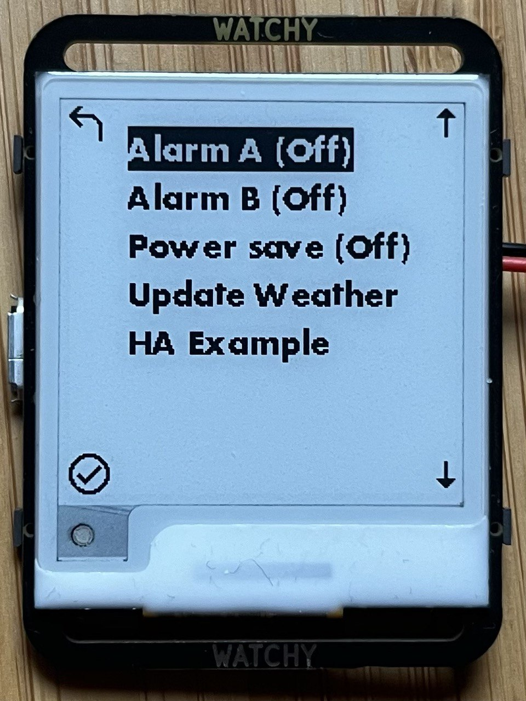

# ESP32 EPaper Smart-Watch

- Firmware for Watchy v3 and v2
- Based on the ESPHome Arduino framework.

## Main Features

<div style="text-align: center;">





</div>

## Overview

Main source code file is:

- v3 hardware ESP32-S3: [./watchy-v3.yaml](./watchy-v3.yaml) (latest)
- v2 hardware ES32: [./watchy-v2.yaml](./watchy-v2.yaml)

[Watchy](https://watchy.sqfmi.com/) is an [open-hardware](https://watchy.sqfmi.com/docs/hardware), ESP32 wrist watch with e-paper display designed by SQFMI.

This project is a complete working firmware, built upon [ESPHome](https://esphome.io/), with [single-file source-code](./watchy-v3.yaml), full v3 hardware support, weather forecast, multiple faces, daily calendar agenda, [pixel-art MDI icons](https://pictogrammers.com/library/mdi/), 2x alarms, stop-watch timers, low-power-mode, firmware updatable over wifi and easy Home Assistant customisation. It is a complete, from-scratch, independent, drop-in replacement for the original Watchy firmware.

It is **not** required to have your own Home Assistant server to use this firmware - the watch can operate as an independent device connecting directly to WiFi, public NTP servers and OpenWeatherMap.org.

## Daily Calendar Agenda with Notifications

Sync daily agenda via Home Assistant [CalDAV](https://www.home-assistant.io/integrations/caldav/) or other integrations. See HA Automation configuration at end of this document.

<div style="text-align: center;">


</div>

A daily agenda summary will show once per day on first sync after midnight. (Dismiss summary with upper-left button.)

Notifications with buzzer will pop-up at event start-time, 10 minutes before and 60 minutes before. Events with zero length (same start and end time) will only notify at the start-time. (Dismiss notifications with upper-left button.)

Press and hold the upper-right button for 3s to see the agenda overview.

(Hover over the images above for alt-text explanations.)

## Multiple Built-in Faces

Included faces (cycle through them using the top-right button):

<div style="text-align: center;">


</div>

## Weather

The watch shows a weather forecast over the upcoming 12 hours. This is a simple, practical, human-ergonomics amount of time for planning ahead using a wrist watch. Max-temp is currently based on `feels_like` forecast over 12 hours.

<div style="text-align: center;">


</div>

The weather forecast can be sourced from any Home Assistant weather integration via an automation or directly from OpenWeatherMap.org.

## Alarms

There is the option to enable two separate alarms via the menu. Choose the alarm from the menu then set hours and minutes.

When an alarm is enabled, the watch face will show alarm-check icon: <span style="display: inline-block; width: 1rem; height: 1rem; line-height: 1rem; ">
<svg viewBox="0 0 22 22" ><path d="M10.54,14.53L8.41,12.4L7.35,13.46L10.53,16.64L16.53,10.64L15.47,9.58L10.54,14.53M12,20A7,7 0 0,1 5,13A7,7 0 0,1 12,6A7,7 0 0,1 19,13A7,7 0 0,1 12,20M12,4A9,9 0 0,0 3,13A9,9 0 0,0 12,22A9,9 0 0,0 21,13A9,9 0 0,0 12,4M7.88,3.39L6.6,1.86L2,5.71L3.29,7.24L7.88,3.39M22,5.72L17.4,1.86L16.11,3.39L20.71,7.25L22,5.72Z" /></svg>
</span>

To silence a buzzing alarm, press the upper-left button.

<div style="text-align: center;">
  
  
  
</div>

## Timers

1. Press the lower-left button to show the timers page
1. Press again to start a new timer, added to the bottom (D)
1. Press again for another timer (E)
1. Press-and-hold (3s) to cancel last timer
1. Press-and-hold (5s) to clear all timers and start over

<div style="text-align: center;">


</div>

The most recent active timer will also show on the digital clock face:

<div style="text-align: center;">

</div>

When the page is full, a button press will discard the oldest timer and start a new one at the bottom. All the other timers move up one slot, maintaining their letter-codes. In this example, A, which has been restarted, moves to the bottom. Then, on another press, B.

<div style="text-align: center;">


</div>

## Weather Faces

These are useful for wall-mounting older/spare Watchy modules:

<div style="text-align: center;">


</div>

## QR Code Contact Card / ID Badge

You know... just in case you accidentally find yourself at a meet-up or conference without a phone, tablet or business card and can't remember your own email or website addresses, don't panic, you have your watch!

([vCard](https://nfraprado.net/post/vcard-rss-as-an-alternative-to-social-media.html) is neat because your information can be scanned directly in to the recipients ~~rolodex~~ contacts app when wifi or internet is unavailable.)

vCard, Website and RSS URL can be set in `secrets.yaml`.

<div style="text-align: center;">


</div>

## The Watch

### Watchy hardware v3 - NEW 2024!

- Watchy v3: [./watchy-v3.yaml](./watchy-v3.yaml)

Update: New (2024) v3 module arrived via [Mouser Electronics](https://au.mouser.com/ProductDetail/SQFMI/SQFMI-WATCHY-10?qs=DRkmTr78QARN9VSJRzqRxw%3D%3D). It has hardware changes including ESP32-S3, RTC and [rearranged pins](https://github.com/sqfmi/Watchy/compare/667d86737dd3dcedf67d83cf69553b28f4e1f38b..master).

<div style="text-align: center;">

</div>

<div style="text-align: center;">


</div>

### Watchy hardware v2

A backwards compatible version is also available for older v2 hardware: [./watchy-v2.yaml](./watchy-v2.yaml)

## About ESPHome

[ESPHome](https://esphome.io/): "is a system to control your microcontrollers by simple yet powerful configuration files and control them remotely through Home Automation systems."

As this project is based on ESPHome, there is excellent, existing documentation and community support for all the submodules and their many customisation options. For example: [wifi with multiple networks](https://esphome.io/components/wifi.html#connecting-to-multiple-networks), [display graphics and rendering](https://esphome.io/components/display/), [fonts and icons](https://esphome.io/components/display/fonts.html), [ePaper drivers](https://esphome.io/components/display/waveshare_epaper.html), [GPIO](https://esphome.io/components/binary_sensor/gpio), [button actions](https://esphome.io/components/binary_sensor/), [NTP time-sync](https://esphome.io/components/time/sntp.html), [time events](https://esphome.io/components/time/#on-time-trigger) and [HTTP API calls](https://esphome.io/components/http_request.html), [ESP32 deep-sleep](https://esphome.io/components/deep_sleep.html), [wireless firmware updates (OTA)](https://esphome.io/components/ota/), [captive portal](https://esphome.io/components/captive_portal.html), [battery voltage ADC](https://esphome.io/components/sensor/adc.html) and many more.

## Design Approach

### Low Power Usage

A [minimalist](https://en.wikipedia.org/wiki/Minimalism), low-distraction, low-interaction, unobtrusive and wearable device.

This is primarily a watch, for showing the time, with a few extra "read-only", "at-a-glance" watch-like complications such as a weather forecast.

Wifi is utilised primarily for read-only connectivity features such as updating accurate internet time, DST adjustments and a weather forecast. It is a truly "automatic" watch!

Wifi, which uses a lot of power, will only activate automatically 4 times a day.

In the future, I hope to sync with a calendar once a day.

### Minimal Interactivity

Interactive features such as the stop-watch and Home Assistant (or MQTT) controls should be used sparingly because the battery is small and the display is slow.

Multiple buttons and long-press buttons remain free for your own extensions.

### No Onboard User Settings UI

Intentionally, this project does not include any on-watch user settings screens or user configuration. The idea is that the ESPHome YAML file is simple and easy enough for it to be edited directly, and re-flashed to the ESP32 device. **The YAML _is_ the settings UI and the main feature of an open-source, programmable, WiFi watch is that it is easily reprogrammable over WiFi.**

## Install / Flash

1. [Install ESPHome compiler](https://esphome.io/guides/getting_started_command_line) and optional [VSCode extension](https://marketplace.visualstudio.com/items?itemName=ESPHome.esphome-vscode)
1. Sign up at https://openweathermap.org/ to get an API key
1. `cp config-example.yaml config.yaml`
1. Edit your `config.yaml` file
1. Connect your Watchy to USB and run `esphome run watchy-v3.yaml`
1. Thats it!

## User Guide

### Buttons

<!--  -->

#### Upper Left :: Power/Home

- Press: Power On / Silence Alarm
- 2nd Press: Home / Wifi On
- Long Press (3s): Set power-saving mode and go to sleep

#### Upper Right :: Cycle Faces

- Press: Cycle watch faces (digital, hands, roman, info, etc) or QR Codes
- Long Press (3s): Show daily agenda

#### Lower Left :: Timers

- Press: Show Timers
- 2nd Press: Start a new timer (up to 5 timers)
- Long Press (3s): Cancel last active timer
- Long Press (5s): Clear all timers

#### Lower Right :: Menu

- Press: Show Settings menu
- Long Press (3s): ePaper Refresh

When in Settings menu:

- Upper Right Button: Up
- Lower Right Button: Down
- Lower Left Button: Select/Save
- Upper Left Button: Exit the menu

<div style="text-align: center;">

</div>

## Installation Notes

### Updating or Changing the Fonts

Download and save `Futura Bold.otf` from:

https://freefonts.co/fonts/futura-bold

Download and save `materialdesignicons-webfont.ttf` from:

https://github.com/Templarian/MaterialDesign-Webfont/tree/master/fonts

Save the files to `fonts` directory.

### Material Design Icons

1. Find new icons over at [Pictogrammers Material Design Icons](https://pictogrammers.com/library/mdi/)
1. Click on the icon and copy the name like this `mdiAbacus` from the code like this `import { mdiAbacus } from '@mdi/js';`
1. Paste the new icon name under the `fonts:` section of `watchy.yaml` with a leading `$`, eg `$mdiAbacus`
1. Then run `cd utils && node generate-mdi.js` to make the icon available in CPP and YAML files
1. Or, alternatively, manually add the new icon to `mdi.yaml` and `mdi.h`

### Install ESPHome compiler tool on Mac OSX

https://esphome.io/guides/installing_esphome.html#mac

    brew install esphome

### Enter Watchy Bootloader Mode (v3 only)

https://watchy.sqfmi.com/docs/getting-started#uploading-new-watchfacesfirmware

To upload new firmware/watchfaces to Watchy, you will need to enter **bootloader** mode

1. Plug in the USB on Watchy
1. Press and hold the top 2 buttons for more than 4 seconds, then release the **Left button first**, before releasing the Up button
1. You should now see an ESP32S3 device enumerate a serial port i.e. COM, cu.\*

### Install Flash with a unique ID

1. `cp config-example.yaml config.yaml`
1. Edit your config.yaml
1. `esphome run watchy-v3.yaml`

### Reset Watchy (v3 only)

1. Press and hold the top 2 buttons for more than 4 seconds, then release the **Right button first**, before releasing the Back button
1. Watchy should now reset, wait a few seconds for it to boot up and refresh the screen

## Home Assistant Setup

### Add Watchy as a device

Follow these instructions:

<https://esphome.io/guides/getting_started_hassio.html#connecting-your-device-to-home-assistant>

Most watch options can be set through the Home Assistant web interface.

<div>

</div>

### Add your Calendar to Home Assistant

Instructions:

<https://www.home-assistant.io/integrations/caldav/>

### Daily agenda automation

Then create an Automation to send agenda to Watchy:

[./automations/watchy-agenda.yaml](./automations/watchy-agenda.yaml)

### Weather forecast automation

Create an automation to send weather to Watchy:

(This automation fetches and sends weather from OpenWeatherMap but it could use any Home Assistant weather forecast source and format it OpenWeatherMap JSON format.)

Add to main `configuration.yaml`:

```
rest_command:
  openweathermap_forecast:
    # http://api.openweathermap.org/data/2.5/forecast?cnt=4&id=2158177&units=metric&lang=en&appid=SECRET
    url: !secret openweathermap_url
```

Create an automation:

[./automations/watchy-weather.yaml](./automations/watchy-weather.yaml)

<https://www.home-assistant.io/integrations/calendar/#action-calendarget_events>

## Watchy Hardware Mods

_Disclaimer: This following is not advice._

I have had the USB socket break off a previous watch so I added epoxy glue around edges of socket and battery clip to secure them.

Then I painted the back electronic components with silicone to keep dry and clean.

<div style="text-align: center;">

</div>

I discarded the huge, clumsy watch case that comes in the box! Threading a Garmin Fenix band through the Watchy PCB slots, I attached the battery to the band under the wrist area. This resulted in a hidden battery and thin watch profile.

<div style="text-align: center;">


</div>

## Patched ESPHome ePaper Component

See https://esphome.io/components/external_components.html

This project uses a slightly modified module, forked from the main ESPHome project.

The minor customisations for Watchy are:

- Prevent a full ePaper refresh on ESP32 boot which is not the desired behaviour for a low-power watch.

  https://github.com/multipolygon/esphome/commit/6407a74ff9855d515cb16fef67f90c748f9800ea

- Add a public `do_full_update()` method to trigger the full-refresh only at certain times of day - a full update clears away ghost pixels.

  https://github.com/multipolygon/esphome/commit/ecf116058cc4b20007126f9099f4b07f4d46b9dd

## Improv: Updating Wifi Name and Password

[Improv protocol](https://www.improv-wifi.com/) is enabled to allow updating the WiFi name and password without doing a full firmware re-flash.

Using Chrome, to go [web.esphome.io](https://web.esphome.io/), then connect, then choose update wifi from the top-right menu list.

See: https://esphome.io/components/improv_serial.html

## Ideas

- Moon phase
- 24h analogue face
- Sync with calendar and daily event summaries
- Clicker-counter mode
- Auto-sleep could be delayed longer if wifi is already disabled
- Preset count-down timers
- Enable/disable hourly chimes on the watch
- [Metric-time faces](https://metric-time.com/)
- Change time-zone on watch when travelling
- An accessible face that buzzes the time in morse code (or simple beats) on the hour (or 15/30 min options)
- Add a face with a background image as a code example

## -

THE SOFTWARE IS PROVIDED "AS IS", WITHOUT WARRANTY OF ANY KIND, EXPRESS OR
IMPLIED, INCLUDING BUT NOT LIMITED TO THE WARRANTIES OF MERCHANTABILITY,
FITNESS FOR A PARTICULAR PURPOSE AND NONINFRINGEMENT. IN NO EVENT SHALL THE
AUTHORS OR COPYRIGHT HOLDERS BE LIABLE FOR ANY CLAIM, DAMAGES OR OTHER
LIABILITY, WHETHER IN AN ACTION OF CONTRACT, TORT OR OTHERWISE, ARISING FROM,
OUT OF OR IN CONNECTION WITH THE SOFTWARE OR THE USE OR OTHER DEALINGS IN THE
SOFTWARE.
